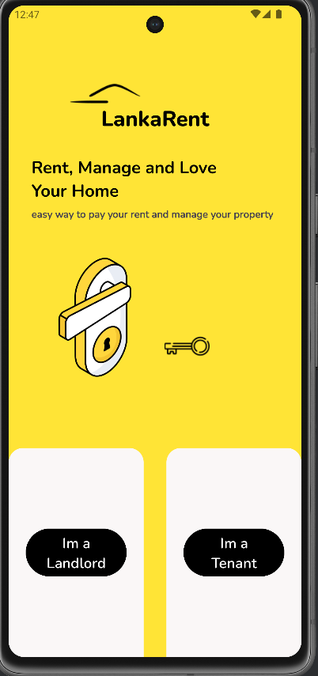
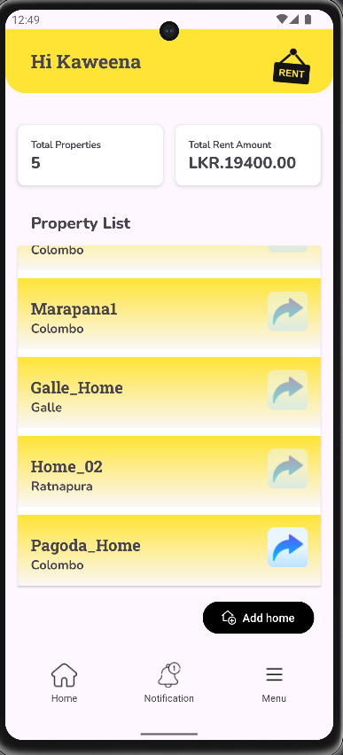
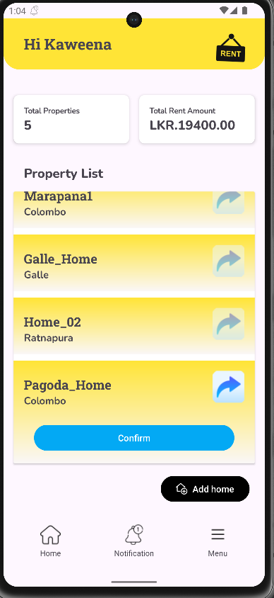
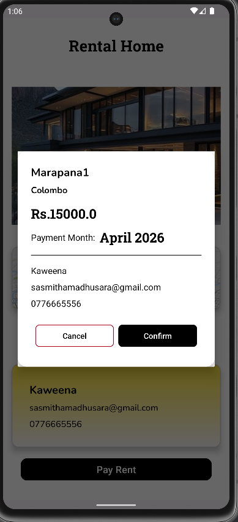

<div align="center">


# 🏠 LankaRent

### A Smart Rental Property Management App for Sri Lanka
</div>

## 📱 Screenshots
<p float="left">
  
  
  
  
</p>

---

## 📖 About

**LankaRent** is a mobile application built for the Sri Lankan rental market that connects **landlords** and **tenants** on a single platform. Landlords can list and manage their properties, while tenants can discover, claim, and pay for rentals — all in one place.

This project was developed as a full-stack Android application with Firebase as the backend, integrating real payments, maps, notifications, and PDF reports.

---

## ✨ Features

### 👤 For Both Users
- Secure **Email/Password authentication** via Firebase Auth
- Email **verification enforcement** before dashboard access
- User **profile management**
- **Push notifications** via Firebase Cloud Messaging (FCM)
- In-app **navigation drawer**

### 🏡 For Landlords
- **Add, edit, and delete** rental properties
- Upload **multiple property images**
- View properties on **Google Maps** with location picker
- See total properties and **total rent income** at a glance
- Automated **payment reminder notifications** for tenants
- Generate and download **PDF payment reports**

### 🔑 For Tenants
- **Claim a rental home** using a unique Home ID
- View detailed **property information** (location, price, images)
- **Pay rent online** via PayHere payment gateway (Sri Lanka)
- View all **transaction history**
- Download **payment receipts as PDF**
- Get **route directions** to their property via Google Maps

---

## 🛠️ Tech Stack

| Category | Technology |
|---|---|
| Language | Java |
| UI Framework | Android XML Layouts, Material Design 3 |
| Backend & Database | Firebase Firestore |
| Authentication | Firebase Auth |
| Push Notifications | Firebase Cloud Messaging (FCM) |
| Maps & Location | Google Maps SDK, Google Play Location Services |
| Image Loading | Glide |
| Payments | PayHere Android SDK |
| PDF Generation | iText7 |
| Networking | OkHttp3 |
| Build System | Gradle (Kotlin DSL) |


## 🚀 Getting Started

### Prerequisites
- Android Studio (Hedgehog or newer)
- Android device / emulator running API 24+
- A Firebase project with Firestore, Auth, and FCM enabled
- A Google Maps API key
- A PayHere merchant account (for payment testing)

### Setup

1. **Clone the repository**
   ```bash
   git clone https://github.com/YOUR_USERNAME/LankaRent.git
   cd LankaRent
   ```

2. **Add Firebase config**  
   Download your `google-services.json` from Firebase Console and place it in:
   ```
   app/google-services.json
   ```

3. **Add Google Maps API Key**  
   Add your key to `local.properties` 

4. **Build and Run**  
   Open in Android Studio → Sync Gradle → Run on device/emulator.

---

## 📦 Key Dependencies

```kotlin
// Firebase
implementation(platform("com.google.firebase:firebase-bom:33.8.0"))
implementation("com.google.firebase:firebase-firestore")
implementation("com.google.firebase:firebase-auth")
implementation("com.google.firebase:firebase-messaging")

// Maps
implementation("com.google.android.gms:play-services-maps:19.0.0")
implementation("com.google.android.gms:play-services-location:21.3.0")

// Payments (Sri Lanka)
implementation("com.github.PayHereDevs:payhere-android-sdk:v3.0.17")

// PDF
implementation("com.itextpdf:itext7-core:7.2.3")

// Image Loading
implementation("com.github.bumptech.glide:glide:4.16.0")
```

---

## 🔮 Future Improvements

- [ ] Migrate from Java to **Kotlin**
- [ ] Adopt **MVVM architecture** with LiveData / ViewModel
- [ ] Add **in-app chat** between landlords and tenants
- [ ] **Property search & filters** (district, price range, type)
- [ ] Multi-language support **(Sinhala / Tamil)**
- [ ] Play Store release

---

## 🙋 Author

**[Sasmitha Kuruppu]**  
📧 kuruppusasmitha@gmail.com
---
